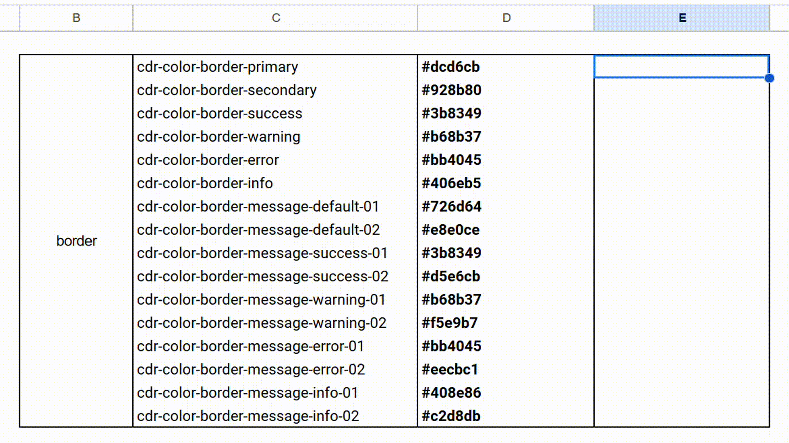

# Google Apps Scripts

My personal Google Apps Scripts I've written to save myself time and headaches.

## Table of Contents
* [How to Use](#how-to-use)
* [Scripts](#scripts)
    - [adjacent-cell-background-fill](#adjacent-cell-background-fill)
   
## How to Use

Files created in Sheets, Docs, Slides, and Forms can act as containers for scripts. Once attached or bound to a document, the script cannot be detached. Scripts may also be created as standalone scripts via the [main Apps Script page](https://script.google.com).

Container-bound scripts are able to call special methods that standalone scripts cannot. These special methods are what allow for the creation of custom menus and dialogs, among other advantages.

To add a script to a file, first open the document you would like to use the script in. Click **Extensions > Apps Script**. Then just copy/paste your chosen script into the editor and hit save. 

## Scripts

### adjacent-cell-background-fill

This script is handy when you have a table or list of color code values but want to be able to represent those colors visually. I use this when modifying or developing color themes. 

Upon running the script, a dialog box will ask for the range of cells that contain hex values. Enter the cell range, click OK, and the adjacent cells will be filled with each corresponding color.

This demonstration uses colors from REI's design system, [Cedar](https://cedar.rei.com/).
